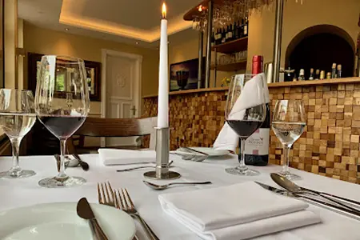
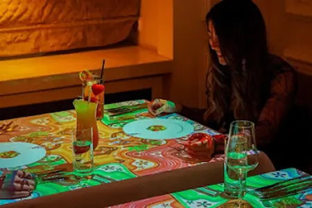

## Introduction

Welcome to the Crimson Witnesses event guide for The International 2025 in Hamburg! The purpose of this guide is to disseminate information relevant to an overall positive experience of the event by answering questions you may have and giving information that may otherwise be hard to find. Information contained within this guide is based on travel experiences to Hamburg, hours of research, community feedback from those living in the area, feedback from attendees of previous ESL events that have been held at the same location, and my own experience at TIs 4-13! I hope that this guide will result in a relaxing, enjoyable, exciting, and safe trip for as many attendees as possible. This is a live document and will be updated with feedback as new information becomes available. Please check the FAQ and leave any additional comments or questions on the Crimson Witnesses Discord or the Reddit post.

> Thank you for reading, and most importantly, enjoy the experience!
>
> \- _Solavi and The Crimson Witnesses_

---

## Know Before You Go

**Tickets**
: [Axs](https://www.axs.com/uk/events/908898/the-international-dota-2-tickets)

**Currency**
: [Euro](https://en.wikipedia.org/wiki/Euro)

**Power outlet type**
: [Type F (Schuko)](https://en.wikipedia.org/wiki/Schuko), Most [Europlugs](https://en.wikipedia.org/wiki/Europlug)

**Phone service/Sim cards**
: Lots of choices in [this article](https://www.mygermanyvacation.com/best-prepaid-sim-card-for-germany/https://www.mygermanyvacation.com/best-prepaid-sim-card-for-germany/)

[**Visa Information**](https://welcome.hamburg.com/entry-and-residence/entry/visa-17522)

---

## Transportation

### Airport

[Hamburg Airport - HAM - Flughafenstr. 1-3, 22335 Hamburg, Germany](https://www.hamburg-airport.de/en)

The transfer from Hamburg Airport to the centre of Hamburg is seamless. From arrival at the central station local trains and public transport are available to the other localities in the city.

#### Transport from Airport

- **Train**

  S-Bahn line S1 takes you from Hamburg Central Station to the airport and back every 10 minutes with a journey time of only 25 minutes each way. You can reach the S-Bahn _Hamburg Airport (Flughafen)_ station directly from Terminals 1 and 2 (Arrivals) via elevators, escalators, and fixed stairs. One stop from _Hamburg Airport_, at the _Ohlsdorf_ underground station, you have the option of changing to the U1 underground line. From previous experience at ESL events in the city, most people opt to stay on the S1 line straight into the city.

- **Bus**

  Another option is to take the bus from the airport to the city centre. The Line 606 bus runs every 30 minutes and takes around 25 minutes to get to the central train station. The cost for a one-way ticket is ~3.30 euros, and you can purchase tickets at the airport or on the bus. There are night buses available also, but the S-Bahn line to the central station is a better option at night. If you would like to use the bus for your onward journey, you will find the stops directly in front of Terminal 1 on Level 0 (arrival).

- **Taxi**

  For a safe and comfortable journey into the city, taxis are available at the taxi stands in front of Terminals 1 and 2. Payments in the taxis can be made in cash as well as cashless; booster seats are available on request. Taking a taxi is one of the fastest and most convenient options to get to the city center. From Hamburg Airport to the city center, the journey takes around 25 minutes in normal traffic conditions. On average, a taxi from Hamburg Airport to the city center costs ~€32.50 during the day and ~€35.70 at night for up to four people.

- **Car**

  There are several car hire options available in Terminals 1 and 2 at the airport. Parking within the city can be expensive and difficult to do at busier times, so making use of the public transport options is recommended.

#### Transport To Venue

##### Public transport (HVV):

Hamburg boasts an extensive public transport system including underground trains, a light-rail network, buses and ferries. The HVV route planner and tickets app (available on iOS and Android) can be used to purchase tickets locally and offers a very useful route planner system in the app, selecting the best route and ticket option. From experience attending previous events in Hamburg, there are always plenty of ticket stations available at all stations, so purchasing all ticket types is easy should you not want to or are unable to download the app.

The HVV Website can also be used ahead of time to plan in advance for your journeys. [Accessible here!](https://www.hvv.de/en/onlineshop)

- **By S-Bahn**

  From Hamburg Hauptbahnhof (S-Bahn) with the S3 direction Pinneberg or S21 direction Elbgaustrasse to stop Stellingen - arenas. From there, you can easily reach the event's shuttle bus service, the O 2 World.

- **By Metrobus**

  **Line 22:** (S-Blankenese - U-Kellinghusenstr.): stop: _Hellgrundweg/Arenas_.  
  **Line 180:** (S-Holstenstr - S-Stellingen - arenas.), stop: At the People's Park.

- **By Train**

  **Hamburg Hauptbahnhof:** S3 direction Pinneberg or S21 direction _Elbgaustrasse_ to stop _Stellingen/Arenas_  
  **Hamburg Dammtorbahnhof:** S21 direction _Elbgaustrasse_ to stop _Stellingen/Arenas_  
  **Hamburg Altona:** S3 direction _Pinneberg_ to stop _Stellingen/Arenas_

##### By Car

- **From the North**

  If you come via the A23, take the AK Hamburg-West on the A7 south and then to the exit Hamburg-Stellingen. Follow it, please follow the signs for "Arena". The same applies to all visitors coming from the A7 from the North.

- **From the East**

  Take the A24 towards Hamburg until the highway ends in a roundabout. There you go the second way in toward the center, Sievekingsallee. These will subsequently be used in Bürgerweide. If you come across a T-junction, turn right onto Wall Street, which turns into Sechslingspforte direction Alster. At the river, turn left and cross the first bridge on the right side (Kennedy Bridge). Then go straight on and follow the main road slightly to your left towards the TV tower. Now, go straight for about 5 miles and then turn right into the Schnackenburgallee; the follow-up car parks are signposted for the arenas.

- **From the South**

  Take the A7 until the exit Hamburg-public park and follow from there just follow the signs and the parking guidance system for "Arena".

- **From the West**

  From the A1, turn on Buchholz triangle on the A261 and continue until the motorway junction Hamburg-southwest. Here you take the A7 north to exit Hamburg-public park and follow the signs from there easily and the parking guidance system for "Arena".

### Rideshare/Taxi Service

Hamburg is serviced by a variety of taxi services as well as [Uber](https://www.uber.com/), [Moia](https://www.moia.io/en/passengers/locations), and [Bolt](https://bolt.eu/en/cities/hamburg/) rideshare services.

### Bike/Scooter Rentals

The scooters are a GREAT way to get around Hamburg and offer an easy form of transport around the city, and at previous ESL events were

Please abide by all local laws when using e-scooters or bikes as a form of transport, as well as the rules below that most hold around the use of these.

1. Wear a helmet
1. Check the brakes before riding
1. Abide by all traffic laws
1. Be 18 years of age or older
1. Have a valid driver’s license or ID
1. One rider per Lime (no passengers)
1. Do not drink alcohol and ride
1. Use caution and take your time when riding at night
1. Never text/call and ride
1. Be aware of cars, bikes, and pedestrians at all times

Companies available for use in Hamburg-  
[Lime](https://www.li.me/en-de/locations/hamburg), [TIER](https://www.tier.app/en/), [Bird](https://www.bird.co/de/), [VOI Scooters](https://www.voi.com/city), [Emmy - Electric Scooter sharing](https://emmy-sharing.de/en/emmy_hamburg/)

---

## Venue

<figure>

<figcaption>Barclays Arena</figcaption>

</figure>

Address
: <address>

    [Hellgrundweg 44 22525 Hamburg](https://maps.app.goo.gl/gwM3pLMuXis8QhSB9)

  </address>

Website
: https://www.barclayscenter.com/

### General Info

[Barclays Arena](https://www.barclays-arena.de/) (originally known as the Color Line Arena and formerly known as barclaycard arena and O2 World Hamburg) is a multipurpose [arena](https://en.wikipedia.org/wiki/Arena) in [Hamburg](https://en.wikipedia.org/wiki/Hamburg), [Germany](https://en.wikipedia.org/wiki/Germany). It opened in 2002 and can hold up to 16,000 people (13,800 or 12,947 for sporting events). It is located at [Altona Volkspark](https://en.wikipedia.org/wiki/Altona_Volkspark), adjacent to the football stadium [Volksparkstadion](https://en.wikipedia.org/wiki/Volksparkstadion) and the [Volksbank Arena](https://de.wikipedia.org/wiki/Volksbank_Arena) in Hamburg's western [Bahrenfeld](https://en.wikipedia.org/wiki/Bahrenfeld) district.

Since opening in November 2002, the Barclays Arena in Hamburg has hosted over 2,500 events, including concerts with Elton John, Ed Sheeran, Metallica, Adele, Jay-Z, the Global Citizen Festival and Olivia Rodrigo, as well as sporting events such as ESL ONE, European and World Handball Championships and heavyweight boxing matches. Every year, over 1 million visitors flock to the more than 130 events. In 2023, northern Germany's largest multi-purpose arena was ranked 6th in Billboard's global ranking of the most successful arenas, with a capacity of up to 15,000 seats.

### Map

<figure>

<figcaption>Barclays Arena Map (Concert Seating Configuration)</captfigcaptionion>

</figure>

### Rules and Restrictions

Below are some important excerpts from the [Venue's Guide](https://www.barclayscenter.com/center-info/a-z-guide):

> [!caution] Bag Policy:
> _"Any bags larger than 10" x 6" x 2" are not permitted inside Barclays Center. We encourage all guests to travel light and leave bags at home. Guests without bags can use Express Lanes to enter the arena faster."_
>
> _"Barclays Center has implemented the above policy to ensure a safe and enjoyable event experience for all guests. Special consideration will be made for guests with medical needs and those caring for infants. This policy does not apply to credentialed media. All bags are subject to thorough screening and will be x-ray screened where available, which may delay entry into Barclays Center. Guests are strongly encouraged to leave their bags at home, or bring bags within the approved size and type."_

> [!Caution] Camera Policy:
> _"Cameras with telephoto or interchangeable/detachable lenses and external flash (professional photography equipment) are not permitted inside Barclays Center at any time. Video recording devices, audio recording devices, monopods, bipods, and tripods are also not permitted. This policy will be strictly enforced, and management reserves the right to deny any electronic device at their discretion."_

On the arena forecourt (height of entrance E2), you will find a container where you can leave larger pieces of luggage for a fee (3€ in cash) for the duration of your event. Please note that the space to store luggage is limited.

From March 1, 2025, all payment terminals in the arena will be converted to cashless payment. At all events, food and drink orders can only be paid for by card at the catering stands, at mobile stations, and in the premium areas and boxes. Only cashless payments will be accepted at the checkrooms and merchandise stands.

Accepted payment methods in the Barclays Arena from March 1, 2025, are:

- VISA
- Mastercard
- AMEX
- Girocard (formerly EC card)
- Debit card
- Apple Pay
- Google Pay

 

For their safety, all guests present are required to wear at least one shirt or T-shirt, one pair of trousers, and one pair of shoes or equivalent and appropriate clothing in which they feel comfortable at all times. The Barclays Arena team reserves the right to refuse entry to or expel from the arena any guest wearing clothing with discriminatory, racist, or sexist text and/or images or prints.

The two central entrances to the arena are **entrances E1** and **E2**. You can reach them via Uwe-Seeler-Allee (formerly Sylvesterallee). The two entrances are located to the left and right at the front ends of the arena; these will take you to the lower and upper tiers.

You can access the interior via **entrance E3**.

**Entrance E5** is the entrance for our premium and box guests as well as guests with the VIP access upgrade.

**Entrance E4** is the entrance for guests of the Platinum Restaurant. This is also where you will usually find the organizer's guest list and the press accreditations.

> [!Note] Food:
> In the 17 fast food outlets spread across the lower and upper tiers, you will not only find arena classics such as currywurst and pizza but also vegetarian and vegan dishes.

> [!Note] Drinks:
> At 5 bars, they offer a wide range of non-alcoholic drinks, as well as beer, wine & spirits.
>
> It is generally not permitted to take drinks into the arena.
>
> If you need to drink fluids regularly for medical reasons, you can take a 0.5-liter PET bottle (without a lid) with you.

Laptops and tablets are not permitted in the Barclays Arena. Exceptions apply to accredited photographers, journalists, and bloggers.

The Barclays Arena is a non-smoking arena. This means that cigarettes, e-cigarettes, and vaporizers are not permitted in the arena. For all smokers, we have set up various smoking areas in the outdoor areas of the arena. Please pay attention to the signs in the Barclays Arena.

Shuttle buses run between the arena and Stellingen S-Bahn station from 2 hours before the start of the event until approximately. 1 hour after the event.

With your ArenaKombi ticket, you can use the shuttle buses as well as the HVV public transport system free of charge on the day of the event to travel to and from the event.

The _red_, _gray,_ and _blue_ parking areas are available around the arena. The parking lots open on the day of the event 2 hours before the start of admission. You can reach the parking lots via Hellgrundweg. The cost is €10 for cars and €30 for coaches and camper vans.

Parking lot BLAU is reserved for premium customers, customers with VIP parking tickets, and people with walking disabilities.

Please note that the parking lots are operated by an external provider and not by Barclays Arena. The parking lots are not guarded. Please do not leave any objects open and visible in your vehicle.

As the entrances and exits to most parking lots (especially BLUE, RED, BROWN, and WHITE) are closed after events, it is not possible to park there for longer periods or to stay after an event.

For almost all events, you can purchase tickets for the VIP parking lots, gray and blue, which are located directly at the Barclays Arena. The parking tickets can usually be booked two months before the event via the respective event page.

> [!Warning] Re-entry Policy:
> According to [Valve](https://www.dota2.com/newsentry/536611691635409409):
>
> _"**Is re-entry permitted?** Yes. On your way out you must scan your ticket when you are exiting the building, otherwise re-entry will not be permitted."_

### Accessibility

Accessibility tickets are available this year for those who need them. On the AXS website, you’ll find an area for accessibility and companions. PGL (Agent) will require official proof of handicap (International handicap card; please bring this with you to the venue also). If you require a wheelchair accessible space, we recommend you contact the venue directly by following this [Link](https://www.barclays-arena.de/besuch-planen/barrierefreiheit/hidden-disabilities-sunflower).

The venue has lifts to all levels and accessible parking on site should you require it. Along with accessible bathrooms on all levels, which can be accessed using a euro key (You can apply for one [here](https://www.seh-netz.info/euroschluessel)).

Wheelchair WCs can be found in the lower tier U3 and U9. In the upper tier, you will find them at blocks O10 and O11.

They also operate a sunflower lanyard should you need one. Again, see the link above for more details.

If you have a service animal, They are allowed into the venue as long as they is harnessed and in a working capacity. You must also have your international handicap card with you.

---

## Accommodations

Hamburg has a wide range of accommodation options, including hotels, hostels, Air Bnbs, and private hires.

Due to the large variety of available options, we have provided a breakdown of the major areas of the city to aid you in deciding what will work best for you.

<figure>

<figcaption>Hamburg City Map</figcaption>

</figure>

### City Center – Altstadt & Neu Stadt

Hamburg's Old Town is a hub of culture and activity. Running alongside the Elbe, it not only provides wonderful canalside strolling opportunities but is home to many beautiful and historic buildings.

They all look incredibly well-kept, but in fact, a lot of them had to be painstakingly rebuilt after the bombing during World War II. That doesn't detract any from the experience though.

> [!Tip]
> This is a pretty good shout for those staying for the first time in Germany/Hamburg as it's reasonably safe and gives a good representation of the city itself. Some of the nicer hotels here can be a bit pricier, but they might be worth it for some!

### St Georg

Northeast of the Altstadt, the St Georg district spans from seedy sex shops around Hamburg’s central station to luxury hotels and penthouse apartments overlooking the Outer Alster lake.

The Hamburg Pride parade kicks off here each year, and the neighborhood remains the most vibrant LGBTQ quarter in town, centered around the hundreds of buzzing bars and cafés along the Lange Reihe. St Georg is also a thriving multi-ethnic community with many Turkish, Indian, Iranian, and Afghan eateries and minimarkets along the Steindamm and around Hansaplatz Square.

> [!Tip]
> If it can be avoided, it is advised not to stay here at all possible. The area is known as being unpleasant, and from reviews of those who have lived in this locality, it is reported that the area can become very unpleasant and unsafe at night, especially for those traveling alone, in pairs, or in small groups. Having said that, for those with a smaller budget, there are some great options here at a very, very reasonable price! This area will almost certainly offer the cheapest rates on accommodation!

### St Paulis

Say hello to one of Europe's largest party districts!. The best pubs and clubs are here! The lively Reeperbahn sits in the pos2dle, while surrounding it lies a swathe of fast food joints, nightlife, live music bars, and places to hang out. It’s loud, proud, and many a tourist head here for a good time! .

Head a bit further out, and you'll uncover a network of affordable bars down narrow alleys, including Große Freiheit, where the Beatles famously found their feet!

> [!Tip]
> This is a great place to stay for those wanting to be where there is plenty to do during the day and night while staying in Hamburg for the event. Staying here also offers a great central location with easy access to the rest of the city and easy links to public transport. This is a great place to stay for those coming in groups or looking for more to do at night after the event ends. Many of the more attractive accommodation options will go early here due to its popularity amongst tourists, so book early!

### Hafencity

South of Hamburg Altstadt, 1 km (under a mile) away from it, Hafencity is one of the most modern areas in town. Known as Europe’s largest regeneration project, the neighborhood has seen many transformations in the last few years. Hafencity’s port area was completely rebuilt and has the largest warehouse district in the world, with canals running through the area and footbridges connecting the separate buildings.

This place is super unique, so of course, it was named a UNESCO World Heritage Site. 

> [!Tip]
> This is a good place to stay if you want somewhere a bit quieter away from the crowds with plenty still to see and access to the city. Hotel and accommodation options here are not as widely available as some of the other areas mentioned here and can be quite pricey, but the area does present itself as a very unique location to stay.

### SternSchanze

Once the beating heart of Hamburg counter-culture, the Sternschanze—also known as the Sternschanze or simply the “Schanze”—is known as the hipster or alternative area of the city offering a lot to see for visitors to the area.

The Schanze remains one of the most engaging neighborhoods in Hamburg, with elegant buildings and a number of great bars, cafes, clubs, record stores, antique shops, and independent boutiques.

> [!Tip]
> This area offers some cool and reasonably priced accommodation options for those visiting for the event. There is a range of private hire accommodations, hotels and hostels here and the area might be perfect for those wanting to stay in an area with lots of character, things to do but all while staying for a reasonable price.

### Dammtor

Dammtor is located to the North of the City Center, 3.3 km (2 miles) away from the Hamburg Townhall. If you’re traveling for business or luxury or want to make your trip as convenient as possible, consider this area!

Dammtor is also where a big train station is located, so you can stay in the area if you’re only visiting Hamburg for a short time, for a business conference, or plan to take day trips around the country.   
The downside of staying here is that there are no notable attractions. But you’re a quick 7-minute U-Han ride away from the City Center and will have a peaceful sleep at night!

> [!Tip]
> Accommodation options here are a bit more expensive than some of the other areas of the city, but this might suit those willing to spend a bit more while staying the city or for those that value a good night's sleep. This area, from previous experience, offers easy access to public transport to friends that also may be staying in other areas for the event!

### Altona Altstadt

Altona-Altstadt is located some 3 km (1.8 miles) from the City Center. If you’re traveling on a budget and want to find an affordable hotel, this district is one of the best places to stay in the city! Its relaxed, urban, and leafy vibe makes it suitable for both families and couples or those looking for a quieter area.

The district is also situated on the Elbe River, which means you’ll have some pretty awesome views, maybe even from your hotel room! 

> [!Tip]
> This area might be useful for those that are booking accommodation a lot closer in time to the event. With this area being a little further from the cities, prices on accommodation can be very reasonable and will more than likely be rooms available here a lot closer to the time of the event!

---

## Cuisine and Refreshment

### At the Venue

Barclays Arena’s concourses boast a total of 17 fast food outlets offering a huge selection of international fast food specialties. Look forward to pizza, bratwurst, burgers, or wraps as well as numerous sweet and savory snacks from popcorn to ice cream to nachos. Of course, you can also quench your thirst at all our fast food outlets.

#### Veggie & Vegan

To ensure that all visitors get their culinary money's worth, since 2019, there has been an outlet in the Barclays Arena where you can get vegetarian and vegan food. You will find the outlet in the lower tier in the U5 area.

#### Onstage Food Corner

Would you like to start your stay at the Barclays Arena in a relaxed atmosphere? Then we recommend a visit to OnStage, which you will find in the basement of the arena.

A small menu awaits you in our self-service restaurant with 180 seats. All dishes are freshly prepared in front of your eyes in the open kitchen. The location is also ideal for company events, family celebrations, or club meetings - whether small or large. To get to the OnStage, use the stairs behind the HOLSTEN Bar on the lower level. On event days, we open at the start of admission (usually two hours before the start of the event; in exceptional cases, only one hour before) and offer extra access to the interior. Feel free to drop by - the OnStage is generally open to the public.

#### Can I bring my own food and drinks to events at the Barclays Arena?

It is generally prohibited to bring any food and drink into the Barclays Arena. Exceptions apply to guests who must bring food and drink into the arena due to illness upon presentation of a medical certificate or appropriate identification. Catering for babies and small children is also excluded from the ban.

### Near the Venue

Food options near the arena are fairly limited. These are the closest, but you should expect a trip to them to take an hour or more between walking and eating. Many more options are available within the locality but would require either public transport, a taxi, or a car share with others at the event.

[ _Grill-Pavillion_](https://pommeskoenig.jimdoweb.com/)
: <ul><li>🍳 Breakfast</li><li>🥪 Lunch</li><li>🍽️ Dinner</li><li>🍔 Fast Food</li><li>🥗 Vegetarian</li><li>🌱 Vegan</li><li>🍺 Beer</li></ul>
: <address>

    [Schnackenburgallee 119 22525 Hamburg](https://maps.app.goo.gl/92L8nyFNfCH2UodVA)

  </address>

[ _Frühstücksladen_](https://www.fruehstuecksladen-eidelstedt.de/)
: <ul><li>🍳 Breakfast</li><li>🥪 Lunch</li><li>☕ Coffee</li></ul>
: <address>

    [Fangdieckstraße 20 22547 Hamburg](https://maps.app.goo.gl/3TX4gbeEp72YtFgx6)

  </address>

[ _Das Moin Moin_](https://www.dasmoinmoin.de/)
: <ul><li>🍳 Breakfast</li><li>🥪 Lunch</li><li>🍔 Fast Food</li><li>🍺 Beer</li></ul>
: <address>

    [Schnackenburgallee 200 22525 Hamburg](https://maps.app.goo.gl/K2EMqEfuFusAQo5PA)

  </address>

[ _Namaste Hamburg_](https://www.namaste-food.de/)
: <ul><li>🥪 Lunch</li><li>🍽️ Dinner</li><li>🥘 Indian</li><li>حلال Halal</li><li>🥗 Vegetarian</li><li>🌱 Vegan</li><li>🍺 Beer</li><li>🍷 Wine</li></ul>
: <address>

    [Ottensener Str. 86 22525 Hamburg](https://maps.app.goo.gl/hzFp3iutxSE79hZp8)

  </address>

[ _Bistro Picknick_](https://bistro-picknick.de)
: Informal all-day snack bar dispensing currywurst, goulash & other unpretentious offerings.
: <ul><li>🍳 Breakfast</li><li>🥪 Lunch</li><li>🍽️ Dinner</li><li>🌱 Vegan</li><li>🍺 Beer</li><li>🍸 Cocktails</li><li>🍷 Wine</li></ul>
: <address>

    [Hellgrundweg 2 22525 Hamburg](https://maps.app.goo.gl/1WmKrgSNbQLWKvJaA)

  </address>

### Hamburg Restaurants

Visit the [Google List](https://maps.app.goo.gl/7hS2okZWvrkhTcZ89) for the most up-to-date list.

#### € (€2-20)

[Google List](https://maps.app.goo.gl/7hS2okZWvrkhTcZ89)

[ _La Casita_](https://lacasita-azul.de/)
: <ul><li>🥪 Lunch</li><li>🍽️ Dinner</li><li>🌮 Mexican</li><li>🥗 Vegetarian</li><li>🌱 Vegan</li><li>🍺 Beer</li><li>🍸 Cocktails</li><li>🍷 Wine</li></ul>
: <address>

    [Neuer Kamp 30 20357 Hamburg](https://maps.app.goo.gl/ePLQYyjMMFHLuerM8)

  </address>

[ _Otto's Burger Ottensen_](https://www.ottosburger.com/)
: <ul><li>🥪 Lunch</li><li>🍽️ Dinner</li><li>🍔 Burgers</li><li>🍺 Beer</li><li>🍸 Cocktails</li><li>🍷 Wine</li></ul>
: <address>

    [Bahrenfelder Str. 175 22765 Hamburg](https://maps.app.goo.gl/iiT9fE7kUhFFzaLHA)

  </address>

[ _Otto's Burger Lange Reihe_](https://www.ottosburger.com/)
: <ul><li>🥪 Lunch</li><li>🍽️ Dinner</li><li>🍔 Burgers</li><li>🍺 Beer</li><li>🍸 Cocktails</li><li>🍷 Wine</li></ul>
: <address>

    [Lange Reihe 40 20099 Hamburg](https://maps.app.goo.gl/aiVnFtqRYzi5GqfD9)

  </address>

[ _Otto's Burger Grindel_](https://www.ottosburger.com/)
: <ul><li>🥪 Lunch</li><li>🍽️ Dinner</li><li>🍔 Burgers</li><li>🍺 Beer</li><li>🍸 Cocktails</li><li>🍷 Wine</li></ul>
: <address>

    [Grindelhof 33 20146 Hamburg](https://maps.app.goo.gl/PoU1WupYMakoiifw8)

  </address>

[ _Otto's Burger Schanze_](https://www.ottosburger.com/)
: <ul><li>🥪 Lunch</li><li>🍽️ Dinner</li><li>🍔 Burgers</li><li>🍺 Beer</li><li>🍸 Cocktails</li><li>🍷 Wine</li></ul>
: <address>

    [Schanzenstraße 58 20357 Hamburg](https://maps.app.goo.gl/UmV1kNdRvfdKjruA6)

  </address>

[ _Maharaja go-go_](https://www.maharaja-hamburg.de/maharaja-41/index.php)
: <ul><li>🥪 Lunch</li><li>🍽️ Dinner</li><li>🥘 Indian</li><li>🥗 Vegetarian</li><li>🌱 Vegan</li><li>🍺 Beer</li><li>🍷 Wine</li></ul>
: <address>

    [Holstenstraße 77 22767 Hamburg](https://maps.app.goo.gl/CS1t9hC8t79jdKjH7)

  </address>

[ _Balutschistan_](https://www.balutschistan-schanze.de/)
: <ul><li>🥪 Lunch</li><li>🍽️ Dinner</li><li>🍛 Pakistani</li><li>🍺 Beer</li><li>🍸 Cocktails</li><li>🍷 Wine</li></ul>
: <address>

    [Schulterblatt 88 20357 Hamburg](https://maps.app.goo.gl/jpQSq63CNmDHJXE77)

  </address>

[ _Brücke 10 am Alten Elbtunnel_](https://bruecke10.com/)
: <ul><li>🥪 Lunch</li><li>🐟 Seafood</li><li>🥗 Vegetarian</li><li>☕ Coffee</li><li>🍺 Beer</li></ul>
: <address>

    [Schanzenweg 12 20457 Hamburg](https://maps.app.goo.gl/XwmD9pP3pMJm2Ct69)

  </address>

[ _Brücke 10_](https://bruecke10.com/)
: Laid-back restaurant serving seafood sandwiches & beers on a landing stage by the harbor.
: <ul><li>🥪 Lunch</li><li>🍽️ Dinner</li><li>🐟 Seafood</li><li>🌱 Vegan</li><li>🍺 Beer</li><li>🍷 Wine</li></ul>
: <address>

    [St. Pauli-Landungsbrücken 10 20359 Hamburg](https://maps.app.goo.gl/kWU9yuPpY63eeqmZ7)

  </address>

[ _Taverna Olympisches Feuer_](http://www.olympisches-feuer.de/) (Website may not function)
: <ul><li>🥪 Lunch</li><li>🍽️ Dinner</li><li>🌱 Vegan</li><li>🍺 Beer</li><li>🍸 Cocktails</li><li>🍷 Wine</li></ul>
: <address>

    [Schulterblatt 36 20357 Hamburg](https://maps.app.goo.gl/vVyQ5e2WteWW7ze2A)

  </address>

[ _Karo Fisch_](https://karofisch.website/)
: Mediterranean seafood delicacies are offered in this compact, unpretentious eatery with a terrace.
: <ul><li>🥪 Lunch</li><li>🍽️ Dinner</li><li>🥙 Mediterranean</li><li>🐟 Seafood</li><li>حلال Halal</li><li>🌱 Vegan</li><li>🍺 Beer</li><li>🍷 Wine</li></ul>
: <address>

    [Feldstraße 32 20357 Hamburg](https://maps.app.goo.gl/yFhnHhRmBXhopbqA7)

  </address>

[ _Underdocks_](https://underdocks.de/)
: Convivial locale with outdoor seating serving creative seafood rolls, sandwiches & tacos.
: <ul><li>🥪 Lunch</li><li>🍽️ Dinner</li><li>🐟 Seafood</li><li>🌮 Tacos</li><li>🥗 Vegetarian</li><li>🌱 Vegan</li><li>🍺 Beer</li><li>🍸 Cocktails</li><li>🍷 Wine</li></ul>
: <address>

    [Neuer Kamp 13 20359 Hamburg](https://maps.app.goo.gl/hKheRuyK8Mhhhsvz9)

  </address>
: <address>

    [Bei den St. Pauli-Landungsbrücken Brücke 3 3 20359 Hamburg](https://maps.app.goo.gl/1wZ86D5VQBq1pwTx6)

  </address>
: <address>

    [Hanseviertel Große Bleichen 32 20354 Hamburg](https://maps.app.goo.gl/tDaRhuanhaGSu7PNA)

  </address>

[ _Schweinske Restaurant Bahrenfeld_](https://schweinske.de/standorte/bahrenfeld)
: <ul><li>🍳 Breakfast</li><li>🥪 Lunch</li><li>🍽️ Dinner</li><li>🥨 German</li><li>🌱 Vegan</li><li>🍺 Beer</li><li>🍸 Cocktails</li><li>🍷 Wine</li></ul>
: <address>

    [Silcherstraße 1 22761 Hamburg](https://maps.app.goo.gl/WA5mDe2WyN1E3Zcr5)

  </address>

[ _Schweinske Restaurant Eimsbüttel_](https://schweinske.de/standorte/eimsbuettel)
: <ul><li>🍳 Breakfast</li><li>🥪 Lunch</li><li>🍽️ Dinner</li><li>🥨 German</li><li>🌱 Vegan</li><li>🍺 Beer</li><li>🍸 Cocktails</li><li>🍷 Wine</li></ul>
: <address>

    [Kieler Str. 284 22525 Hamburg](https://maps.app.goo.gl/cPf9if8LozBbgLzU8)

  </address>

[ _Jim Burrito's_](https://www.jimburritos.com/)
: Compact, casual space offering Mexican specialties, cocktails & a take-out option.
: <ul><li>🍽️ Dinner</li><li>🌮 Tacos</li><li>🥗 Vegetarian</li><li>🌱 Vegan</li><li>🍺 Beer</li><li>🍸 Cocktails</li></ul>
: <address>

    [Schulterblatt 12 20357 Hamburg](https://maps.app.goo.gl/Gb8EMpGCUP1i116q6)

  </address>

Mama Kumpir
: <address>

    [Langenfelder Damm 90 22525 Hamburg](https://maps.app.goo.gl/rABoKtuVzzndk9XLA)

  </address>

Asia Imbiss Kim
: <address>

    [Hein-Hoyer-Straße 78 20359 Hamburg](https://maps.app.goo.gl/TbCBUHeDuWeYRxsC7)

  </address>

[Cup n' Go](https://wolt.com/de/deu/hamburg/restaurant/cup-n-go) (Fast food)
: <address>

    [Grindelhof 7 20146 Hamburg](https://maps.app.goo.gl/i2zoS9cPpheT5Cmf9)

  </address>

[Sphinx Döner Landwehr](https://sphinxdoener.de/)
: <address>

    [Landwehr 39 22087 Hamburg](https://maps.app.goo.gl/C3mCRYkWM31nwNjj8)

  </address>

[Monsieur Alfons](https://www.monsieur-alfons-hamburg.de/) (Fast food)
: <address>

    [Holstenpl. 14 22765 Hamburg](https://maps.app.goo.gl/GPApNSNTHMcEiiqCA)

  </address>

[Grill-Pavillon](https://pommeskoenig.jimdoweb.com/)
: <address>

    [Schnackenburgallee 119 22525 Hamburg](https://maps.app.goo.gl/AAf9JoxNYT2MSL5k6)

  </address>

[HOB's Hut of Burger](https://wolt.com/de/deu/hamburg/restaurant/hobs-hut-of-burger-hamburg)
: <address>

    [Ballindamm 40/2.0G 20095 Hamburg](https://maps.app.goo.gl/myA9G9ToAwzLuixH9)

  </address>

Big Food Imbiss
: <address>

    [Schulterblatt 13 20357 Hamburg](https://maps.app.goo.gl/zHD9i7d9q8e7JqeA7)

  </address>

[Kleine Pause](https://www.kleine-pause.de/)
: <address>

    [Wohlwillstraße 37 22767 Hamburg](https://maps.app.goo.gl/fUMvvsxrwbmNTzYr8)

  </address>

[Eppendorfer Grill-Station](https://www.eppendorfer-grillstation.de/)
: <address>

    [Eppendorfer Weg 172 20253 Hamburg](https://maps.app.goo.gl/XkoVqgreD26m95x8A)

  </address>

[Imbiss bei Schorsch](https://imbiss-bei-schorsch.de/)
: <address>

    [Beim Grünen Jäger 14 20359 Hamburg](https://maps.app.goo.gl/GvcGaxt9LpAuZ4fa7)

  </address>

[Köz Sultan Kebap Döner](https://wolt.com/de/deu/hamburg/restaurant/koez-sultan-kebap-doener-hamburg)
: <address>

    [Große Bergstraße 243 22767 Hamburg](https://maps.app.goo.gl/ddiS79rMraU2HL8F8)

  </address>

[Arin Kebap](https://wolt.com/de/deu/hamburg/restaurant/arin-kebap)
: <address>

    [Gerhofstraße 40 20354 Hamburg](https://maps.app.goo.gl/3dKMQkfC11HmX5d9A)

  </address>

[Rollmops Sushi Hamburg Hbf](https://www.rollmops-sushi.de/)
: <address>

    [Ernst-Merck-Straße 6 20099 Hamburg](https://maps.app.goo.gl/DW8oP9FryMxGctZr7)

  </address>

[Injera Eritrean und Ethiopian Restaurant](https://wolt.com/de/deu/hamburg/restaurant/injera-eritrean-und-ethiopian-restaurant)
: <address>

    [Brennerstraße 35 20099 Hamburg](https://maps.app.goo.gl/qWHtnKpoAdFHnddL7)

  </address>

[Royal Punjab - Indisches Restaurant - Hamburg](https://speisekartenweb.de/restaurants/hamburg/royal-punjab---indisches-restaurant---hamburg-247109)
: <address>

    [Ernst-Merck-Straße 4 20099 Hamburg](https://maps.app.goo.gl/SyACifQtJ1kgs3XYA)

  </address>

[Eat](https://www.tripadvisor.ie/Restaurant_Review-g187331-d11869434-Reviews-Eat-Hamburg.html)
: <address>

    [Gerhofstraße 18 20354 Hamburg](https://maps.app.goo.gl/QGY5hAMkc3Pc8yuMA)

  </address>

[Salam](https://www.salam-city.de/index.html)
: <address>

    [Rathausstraße 12 20095 Hamburg](https://maps.app.goo.gl/ePcoov5XWh7CFf2M7)

  </address>

[Restaurant Herr Kwong](https://social.quandoo.com/en/groups/Restaurant-Herr-Kwong)
: <address>

    [Burchardstraße 16 20095 Hamburg](https://maps.app.goo.gl/qdi3ha7ebDEnvdUz9)

  </address>

[Thai Gourmet](https://www.thai-gourmet-imbiss-hamburg.de/)
: <address>

    [Spitalerstraße 22 20095 Hamburg](https://maps.app.goo.gl/zeA2cQ2EGMhnwnkd9)

  </address>

[An An Vietnam & Thai Cuisine](https://www.ananthaicuisinehamburg.de/)
: <address>

    [Lange Reihe 2 20099 Hamburg](https://maps.app.goo.gl/wy4hQsnJxzpnSFZdA)

  </address>

[Badshah Restaurant](https://badshahrestaurant.de/en/home/)
: <address>

    [Bremer Reihe 24 20099 Hamburg](https://maps.app.goo.gl/zw7jR5v4XMeg3G1G9)

  </address>

[Klempau's PAULANER Biergarten an der Milchhalle](https://klempaus-biergarten.eatbu.com/?lang=en)
: <address>

    [August-Kirch-Straße 55 22525 Hamburg](https://maps.app.goo.gl/muu97zWf1Dizyum36)

  </address>

[Seoul 1988 Grindelhof](https://www.lieferando.de/speisekarte/seoul-1988-grindelhof)
: <address>

    [Grindelhof 2 20146 Hamburg](https://maps.app.goo.gl/17TxbMbLYEYrFw4B6)

  </address>

[Seoul 1988 Innenstadt](https://www.lieferando.de/speisekarte/seoul-1988-innenstadt)
: <address>

    [Mohlenhofstraße 7 20095 Hamburg](https://maps.app.goo.gl/dNutYpkMzFH7GoBX7)

  </address>

[Takumi Ramen Station Ottensen](https://www.facebook.com/takumihamburg/)
: <address>

    [Große Rainstraße 20 22765 Hamburg](https://maps.app.goo.gl/izCnLcdomJnLuMYU8)

  </address>

[Kōgai - Sushi Hamburg](https://wolt.com/de/deu/hamburg/restaurant/kgai-sushi-hamburg)
: <address>

    [Valentinskamp 89 20354 Hamburg](https://maps.app.goo.gl/jwaf99GqxXwVtXyd9)

  </address>

[Ume no Hana](https://restaurantplus.net/store/umenohana)
: <address>

    [Thadenstraße 15 22767 Hamburg](https://maps.app.goo.gl/cEkuJ7hnAnhRomVf6)

  </address>

The Ramen Hamburg
: <address>

    [Rosenstraße 5 20095 Hamburg](https://maps.app.goo.gl/8GH5Jmfm5NyRyQkP6)

  </address>

Mr. Dam
: <address>

    [Mottenburger Twiete 4-8 22765 Hamburg](https://maps.app.goo.gl/9GaQXDEeVxVe43xb6)

  </address>

Carlos Sambrosa
: <address>

    [Glockengießerwall 8 20095 Hamburg](https://maps.app.goo.gl/hBfTMBD76YCk9eiN9)

  </address>

La Delizia Restaurant
: <address>

    [Hoheluftchaussee 66 20253 Hamburg](https://maps.app.goo.gl/TrfySXTyt7KXbpfu8)

  </address>

Panda's Küche
: <address>

    [Bahrenfelder Chaussee 178 22761 Hamburg](https://maps.app.goo.gl/Z7BCDxfE8btbUAXx5)

  </address>

Tazzi Pizza
: <address>

    [Clemens-Schultz-Straße 18 20359 Hamburg](https://maps.app.goo.gl/4H9GreZMGQycnHJx6)

  </address>

NOM Vietnamese fusion food
: <address>

    [Zeughausmarkt 17 20459 Hamburg](https://maps.app.goo.gl/ucPgnYPDgWACSEPHA)

  </address>

Hoang Deli Restaurant
: <address>

    [Heußweg 48 20255 Hamburg](https://maps.app.goo.gl/Um2QPWNeVR2cp94q6)

  </address>

Shiso Burger Hamburg
: <address>

    [Bugenhagenstraße 23 20095 Hamburg](https://maps.app.goo.gl/HFqYYMzXji98itSU8)

  </address>

O-Ren Ishii
: <address>

    [Kleine Reichenstraße 18 20457 Hamburg](https://maps.app.goo.gl/ZjZu9S1aWXkYT3Pq9)

  </address>

Copos2a Taqueria Mexicana
: <address>

    [Gerhart-Hauptmann-Platz 48 20095 Hamburg](https://maps.app.goo.gl/mn8QMhVVCZJtVf9K6)

  </address>

Haus5 Restaurant
: <address>

    [Seewartenstraße 10 20459 Hamburg](https://maps.app.goo.gl/ZMrGMk9xgtWr2Dof6)

  </address>

Restaurant Due Amici
: <address>

    [Walddörferstraße 1a 22041 Hamburg](https://maps.app.goo.gl/2uBUEcnE31MrRCa39)

  </address>

Altstädter Stube Willig
: <address>

    [Altstädter Str. 17 20095 Hamburg](https://maps.app.goo.gl/X8ZPAYPy3ejAgs96A)

  </address>

Restaurant Gran Sasso
: <address>

    [Schlüterstraße 12 20146 Hamburg](https://maps.app.goo.gl/c2YoCJoypP7f4Hyo7)

  </address>

Curry Lounge Hamburg(Thai Indische) Restaurant
: <address>

    [Steindamm 79 20099 Hamburg](https://maps.app.goo.gl/ExqLdcZSctYxrDmV7)

  </address>

Quan Do Hauptbahnhof
: <address>

    [Georgspl. 16 20099 Hamburg](https://maps.app.goo.gl/VdmTuVn8vzHv7vHG8)

  </address>

Wloka‘s
: <address>

    [Ballindamm 40 20095 Hamburg](https://maps.app.goo.gl/ANccaWU6oHNMtn4h7)

  </address>

#### €€ (€20-40)

[Google List](https://maps.app.goo.gl/YkuBzCRrxP4f9f6r7)

Hatari Pfälzer Stube
: <address>

    [Schanzenstraße 2-4 20357 Hamburg](https://maps.app.goo.gl/H4cbXF6siLYUjJbg6)

  </address>

Maharaja
: <address>

    [Detlev-Bremer-Straße 41 20359 Hamburg](https://maps.app.goo.gl/86Fh9miA4qL4BAKr6)

  </address>

BLOCK HOUSE Pöseldorf
: <address>

    [Mittelweg 122 20148 Hamburg](https://maps.app.goo.gl/9iyNPkStfoteeLVH9)

  </address>

BLOCK HOUSE Othmarschen
: <address>

    [Waitzstraße 1 22607 Hamburg](https://maps.app.goo.gl/gq3ctVhrDgUwsVCe6)

  </address>

BLOCK HOUSE Eidelstedt
: <address>

    [Alte Elbgaustraße 9 22523 Hamburg](https://maps.app.goo.gl/9dtgNJ3jFiXW3F3v5)

  </address>

BLOCK HOUSE Eppendorf
: <address>

    [Hoheluftchaussee 2 20253 Hamburg](https://maps.app.goo.gl/WtQB3cvqP8JemXmy9)

  </address>

BLOCK HOUSE Jungfernstieg
: <address>

    [Jungfernstieg 1 20095 Hamburg](https://maps.app.goo.gl/fwgyQhRTAqmzGJSa6)

  </address>

BLOCK HOUSE Kirchenallee
: <address>

    [Kirchenallee 49-51 20099 Hamburg](https://maps.app.goo.gl/3j8bhxoQhCqjFZmS9)

  </address>

La Sepia
: <address>

    [Neuer Pferdemarkt 16 20357 Hamburg](https://maps.app.goo.gl/ZnomBmNUQMnJ9GuP6)

  </address>

SEOUL 1988 Karolinenviertel
: <address>

    [Karolinenstraße 1 20357 Hamburg](https://maps.app.goo.gl/QgK6u5euNfdCgcPA7)

  </address>

SEOUL 1988 Eimsbüttel
: <address>

    [Müggenkampstraße 86 20257 Hamburg](https://maps.app.goo.gl/NiVQvBKiRobxu6Nq5)

  </address>

Quan 36 too
: <address>

    [Kurze Mühren 6 20095 Hamburg](https://maps.app.goo.gl/oLp2Xr9d3znKLJdV8)

  </address>

Nomi Japanese Restaurant
: <address>

    [Zeughausmarkt 21 20459 Hamburg](https://maps.app.goo.gl/GB2R2psFNRFNG4529)

  </address>

Nakama
: <address>

    [Willy-Brandt-Straße 51 20457 Hamburg](https://maps.app.goo.gl/FfPWzGWfFtmbjpTo8)

  </address>

Kampai Sushi Bar (Possibly Closed)
: <address>

    [Hamburger Berg 25 >20359 Hamburg >Germany](https://maps.app.goo.gl/24Es62kVTjYjHW9HA)

  </address>

Takumi Ramen Station Schanze
: <address>

    [Schulterblatt 114 20357 Hamburg](https://maps.app.goo.gl/H8tHU6r4hACUVanD7)

  </address>

Yaku-Restaurante
: <address>

    [Schlüterstraße 79 20146 Hamburg](https://maps.app.goo.gl/1aSPmUniMN4pmCQJ9)

  </address>

memán restaurant
: <address>

    [Schulterblatt 72 20357 Hamburg](https://maps.app.goo.gl/5SEUyKMWWBjcFQqu6)

  </address>

Restaurant Picasso
: <address>

    [Rathausstraße 14 20095 Hamburg](https://maps.app.goo.gl/EgPrNPz7ZRpNYEBJ8)

  </address>

Restaurant Békaa
: <address>

    [Rentzelstraße 50 20146 Hamburg](https://maps.app.goo.gl/8A5Vzr5W21SehzLg7)

  </address>

Restaurant Madame Hu
: <address>

    [b. d. Schilleroper 6 22767 Hamburg](https://maps.app.goo.gl/RxgUbUzpnvfCjkWa7)

  </address>

Schifferbörse Restaurant
: <address>

    [Kirchenallee 46 20099 Hamburg](https://maps.app.goo.gl/jDVZxPqQ5ZMLNyvk7)

  </address>

Chango cantina mexicana
: <address>

    [Holzbrücke 7 20459 Hamburg](https://maps.app.goo.gl/rxrgcUuWUP8a2Vo89)

  </address>

Kleinhuis´ Restaurant bei der Staatsoper
: <address>

    [Fehlandtstraße 26<br/.>20354 Hamburg<br/.>Germany](https://maps.app.goo.gl/kfwYHrYGcVFAcY1z5)

  </address>

Restaurant - Hamburger Elbspeicher
: <address>

    [Große Elbstraße 39 22767 Hamburg](https://maps.app.goo.gl/pSRefosiHH2CAZgs5)

  </address>

Restaurant Im Sprinkenhof
: <address>

    [Burchardstraße 8 20095 Hamburg](https://maps.app.goo.gl/VCqhY2qSfFzSoZK59)

  </address>

Elsa's Restaurant & Bar
: <address>

    [Bahrenfelder Steindamm 99 22761 Hamburg](https://maps.app.goo.gl/xpViku9XL7m6ZQ4J8)

  </address>

Restaurant Fives am Fischmarkt
: <address>

    [Fischmarkt 5 22767 Hamburg](https://maps.app.goo.gl/vZhSJAfGbLpfC7v58)

  </address>

Restaurant Irodion
: <address>

    [Ohlsdorfer Str. 1 22299 Hamburg](https://maps.app.goo.gl/9voFQkwcijkQL4G16)

  </address>

Restaurant L´Orient Bahrenfelder
: <address>

    [Bahrenfelder Str. 172 22765 Hamburg](https://maps.app.goo.gl/8TNU53WbmLjW22gp7)

  </address>

Ja an Restaurant Altona
: <address>

    [Klopstockpl. 3 22765 Hamburg](https://maps.app.goo.gl/ZJodB7NwdkQHQdF19)

  </address>

Restaurant Porticello
: <address>

    [Kajen 12 20459 Hamburg](https://maps.app.goo.gl/ffYoRvqyMpUAAN466)

  </address>

Marktkoenig
: <address>

    [Neuer Kamp 31 20359 Hamburg](https://maps.app.goo.gl/RwpXANpsSAG52mvGA)

  </address>

Tunici Restaurants Bahrenfeld
: <address>

    [Luruper Ch 2 22761 Hamburg](https://maps.app.goo.gl/Qqo3BDubrgXMoDoG9)

  </address>

Opitz - German Restaurant
: <address>

    [Mundsburger Damm 17 22087 Hamburg](https://maps.app.goo.gl/USxnxtA19ZXt88VT7)

  </address>

Restaurant La Fee
: <address>

    [Hofweg 50 22085 Hamburg](https://maps.app.goo.gl/3CKQJPhjtBgZegmD7)

  </address>

Vous Restaurant & Bar
: <address>

    [Gertigstraße 7 22303 Hamburg](https://maps.app.goo.gl/VfjMTNpCNe3UfwNa7)

  </address>

Restaurant L´Orient
: <address>

    [Osterstraße 146 20255 Hamburg](https://maps.app.goo.gl/Ec8E8rhCMZRxTrzt5)

  </address>

Gassenhaur Restaurant & Beisl
: <address>

    [Kastanienallee 32 20359 Hamburg](https://maps.app.goo.gl/sJi268mFvRADZVEv6)

  </address>

Madame Mai Hamburg
: <address>

    [Stahltwiete 19a 22761 Hamburg](https://maps.app.goo.gl/GkacENbg7RCm44iE7)

  </address>

Restaurant Brook
: <address>

    [b. den Mühren 91 20457 Hamburg](https://maps.app.goo.gl/1foeH1PMpzGMMzSa9)

  </address>

Restaurant | kaalia
: <address>

    [Rentzelstraße 13 20146 Hamburg](https://maps.app.goo.gl/3StAKrADR9VbjAHF9)

  </address>

Saray Köz
: <address>

    [Kreuzweg 12 20099 Hamburg](https://maps.app.goo.gl/1uUAmqUxQsR44UR19)

  </address>

LOKMAM KÖZ
: <address>

    [Susannenstraße 16 Ecke Bartelsstraße 43 20357 Hamburg](https://maps.app.goo.gl/qsGfzjCq2VYWs1nx7)

  </address>

[ _The Madison Restaurant_](the-madison-restaurant)
: Trendy hotel restaurant offering all-day Italian- & Asian-inspired dining, plus a breakfast buffet.
: <ul><li>🥪 Lunch</li><li>🍽 Dinner</li><li>🍝 Italian</li><li>🥗 Vegetarian</li><li>🍺 Beer</li><li>🍸 Cocktails</li><li>🍷 Wine</li></ul>
: <address>

    [Schaarsteinweg 4 20459 Hamburg](https://maps.app.goo.gl/7VgoSneWSBmufYK26)

  </address>

[ _L'Amira Steindamm_](https://lamira-steindamm.de/)
: <ul><li>🍳 Breakfast</li><li>🥪 Lunch</li><li>🍽 Dinner</li><li>🧆 Lebanese</li><li>حلال Halal</li><li>🥗 Vegetarian</li><li>🌱 Vegan</li></ul>
: <address>

    [Steindamm 58 20099 Hamburg](https://maps.app.goo.gl/E27T7LLYv3LrxY4c8)

  </address>

[ _Restaurant Charmant_](https://www.restaurant-charmant.de/)
: Pasta dishes, pizzas, roast meats & schnitzels in tranquil, low-lit surroundings.
: <ul><li>🥪 Lunch</li><li>🍽 Dinner</li><li>🥨 German</li><li>🍝 Pasta</li><li>🥗 Vegetarian</li><li>🍺 Beer</li><li>🍸 Cocktails</li><li>🍷 Wine</li></ul>
: <address>

    [Basselweg 102 22527 Hamburg](https://maps.app.goo.gl/HEgwuFwk1z8qQnyy9)

  </address>

#### €€€ (€40-70)

[Google List](https://maps.app.goo.gl/Ydk34ZMjkxBuH9Vs8)

[ _Kofookoo_](https://sushigrillbar.kofookoo.de/)
: <ul><li>🥪 Lunch</li><li>🍽 Dinner</li><li>🍱 Japanese</li><li>🍣 Sushi</li><li>حلال Halal</li><li>🥗 Vegetarian</li><li>🌱 Vegan</li><li>🍺 Beer</li><li>🍸 Cocktails</li><li>🍷 Wine</li></ul>
: <address>

    [Neuer Kamp 31 Rindermarkthalle 20359 Hamburg](https://maps.app.goo.gl/pkEbscGHD6YAu2nU8)

  </address>

[ _Tschebull Restaurant|Beisl|Bar_](https://www.tschebull.de/de/)
: Classic Austrian-style tapas & meat dishes, plus a long wine list, in a formal dining room.
: <ul><li>🥪 Lunch</li><li>🍽 Dinner</li><li>🥧 Austrian</li><li>🥩 Meat</li><li>🌱 Vegan</li><li>🍺 Beer</li><li>🍸 Cocktails</li><li>🍷 Wine</li></ul>
: <address>

    [Mönckebergstraße 7 20095 Hamburg](https://maps.app.goo.gl/yC1xoRYFt6VxqEZf6)

  </address>

[ _Deichgraf Restaurant_](https://speisekartenweb.de/restaurants/hamburg/deichgraf-restaurant-30023?utm_source=google_profile&utm_medium=google_profile&utm_campaign=admin)
: Salted meat labskaus & other northern specialities in a posh dining room or on a sidewalk terrace.
: <ul><li>📅 Reservation Required</li><li>🥪 Lunch</li><li>🍽 Dinner</li><li>🥨 German</li><li>🥩 Meat</li><li>🌱 Vegan</li><li>🍺 Beer</li><li>🍷 Wine</li></ul>
: <address>

    [Deichstraße 23 20459 Hamburg](https://maps.app.goo.gl/TkbcGnmR7bcsSXPB6)

  </address>

[ _Restaurant Cox_](https://www.restaurant-cox.de/cox.html)
: Longstanding, rustic-chic tavern offering game dishes like wild boar & an extensive wine selection.
: <ul><li>🥪 Lunch</li><li>🍽 Dinner</li><li>🥩 Meat</li><li>🥗 Vegetarian</li><li>🌱 Vegan</li><li>🍺 Beer</li><li>🍸 Cocktails</li><li>🍷 Wine</li></ul>
: <address>

    [Lange Reihe 68 Greifswalder Str. 43 20099 Hamburg](https://maps.app.goo.gl/QXLSSLk2tqZtF1e87)

  </address>

[ _Fischereihafen Restaurant_](https://www.fischereihafenrestaurant.de/en/)
: Lively, long-running place for oysters, caviar & grilled seafood, with views of the harbor.
: <ul><li>📅 Reservation Required</li><li>🥪 Lunch</li><li>🍽 Dinner</li><li>🐟 Seafood</li><li>🦪 Oysters</li><li>🍺 Beer</li><li>🍸 Cocktails</li><li>🍷 Wine</li></ul>
: <address>

    [Große Elbstraße 143 22767 Hamburg](https://maps.app.goo.gl/eaHh6cRmJJAT3J3x5)

  </address>

[ _Das Dorf_](https://restaurant-dorf.de/eng/)
: Informal eatery serving local staples including schnitzel, meat plates & desserts, plus draft beer.
: <ul><li>🍽 Dinner</li><li>🥨 German</li><li>🍺 Beer</li><li>🍸 Cocktails</li><li>🍷 Wine</li></ul>
: <address>

    [Lange Reihe 39 20099 Hamburg](https://maps.app.goo.gl/7nJW26kgBJxmJvuZ8)

  </address>

[ _NENI_](https://nenifood.com/restaurants/hamburg)
: Upmarket pos2dle Eastern classics, served in an airy, industrial-chic space with kelim rugs.
: <ul><li>🍳 Breakfast</li><li>🥪 Lunch</li><li>🍽 Dinner</li><li>🧆 pos2dle Eastern</li><li>حلال Halal</li><li>🥗 Vegetarian</li><li>🌱 Vegan</li><li>🍺 Beer</li><li>🍸 Cocktails</li><li>🍷 Wine</li></ul>
: <address>

    [Osakaallee 12 20457 Hamburg](https://maps.app.goo.gl/aF8ML79sfSbw82m76)

  </address>

[ _Petit Bonheur_](https://www.petitbonheur-restaurant.de/)
: Romantic restaurant with red walls & eclectic artwork, serving classic French dishes & wines.
: <ul><li>🥪 Lunch</li><li>🍽 Dinner</li><li>🥖 French</li><li>🍺 Beer</li><li>🍸 Cocktails</li><li>🍷 Wine</li></ul>
: <address>

    [Hütten 85-86 20355 Hamburg](https://maps.app.goo.gl/RxUw2zDbnNzAY4wg9)

  </address>

[ _philipps Restaurant_](https://www.philipps-restaurant.de/)
: Modern space with a rustic-chic vibe for an international menu of pasta, schnitzels & steak tartare.
: <ul><li>🥪 Lunch</li><li>🍽 Dinner</li><li>🥨 German</li><li>🍝 Pasta</li><li>🥩 Steak</li><li>🍺 Beer</li><li>🍸 Cocktails</li><li>🍷 Wine</li></ul>
: <address>

    [Turnerstraße 9 20357 Hamburg](https://maps.app.goo.gl/X67Th6qLWjzvsRLY8)

  </address>

[ _Restaurant Casa di Roma_](https://casadiroma.de/)
: Creatively presented antipasti, pasta & mains, plus a robust wine list, at a stylish trattoria.
: <ul><li>🥪 Lunch</li><li>🍽 Dinner</li><li>🍝 Italian</li><li>🥙 Mediterranean</li><li>🍺 Beer</li><li>🍸 Cocktails</li><li>🍷 Wine</li></ul>
: <address>

    [Lange Reihe 76 20099 Hamburg](https://maps.app.goo.gl/xHGQn28pLvSkXWE3A)

  </address>

[ _PATIO Restaurant Weinbar_](https://patio.hamburg/)
: Contemporary Mediterranean cuisine, tapas & wine in a stylishly designed space with dark accents.
: <ul><li>🍳 Breakfast</li><li>🥑 Brunch</li><li>🥪 Lunch</li><li>🍽 Dinner</li><li>🥙 Mediterranean</li><li>🍺 Beer</li><li>🍸 Cocktails</li><li>🍷 Wine</li></ul>
: <address>

    [Poelchaukamp 33 22301 Hamburg](https://maps.app.goo.gl/12p1sRWX6NG5TBUx8)

  </address>

[ _Restaurant Freudenhaus St. Paulim_](https://www.stpauli-freudenhaus.de/restaurant/)
: Robust northern German meat & fish dishes in a cozy, elaborately decorated bar/restaurant.
: <ul><li>📅 Reservation Required</li><li>🍽 Dinner</li><li>🥨 German</li><li>🐟 Seafood</li></ul>
: <address>

    [Hein-Hoyer-Straße 7-9 20359 Hamburg](https://maps.app.goo.gl/v2FADDsNE3MxLKwS7)

  </address>

#### €€€€ (€100+)

[Google List](https://maps.app.goo.gl/EbM1JYgna85GGrKGA)

[ _The Table_](https://the-table-hamburg.de/)
: Elevated global cuisine around a single table snaking around a stylish room with an open kitchen.
: <ul><li>📅 Reservation Required</li><li>👨‍🍳 Fine Dining</li><li>🍽 Dinner</li><li>🍸 Cocktails</li><li>🍷 Wine</li></ul>
: <address>

    [Shanghaiallee 15 20457 Hamburg](https://maps.app.goo.gl/PsdhbrPmNvAZS4BfA)

  </address>

[ _Petit Amour_](https://petitamour-hh.com/)
: Urbane choice with understated decor & a terrace specializing in imaginative French cuisine.
: <ul><li>📅 Reservation Required</li><li>👨‍🍳 Fine Dining</li><li>🍽 Dinner</li><li>🥖 French</li><li>🍷 Wine</li></ul>
: <address>

    [Spritzenpl. 11 22765 Hamburg](https://maps.app.goo.gl/6fwzh1Cxjr2pwvuQ9)

  </address>

[ _Haerlin Restaurant_](https://hvj.de/en/restaurant-haerlin.html)
: Sophisticated plates of seasonally inspired cuisine, plus wine, offered in refined pastel surrounds.
: <ul><li>⭐ Michelin Starred</li><li>📅 Reservation Required</li><li>👨‍🍳 Fine Dining</li><li>🍽 Dinner</li><li>🍸 Cocktails</li><li>🍷 Wine</li></ul>
: <address>

    [Neuer Jungfernstieg 9-14 20354 Hamburg](https://maps.app.goo.gl/yw5ibtnajQ3CPKPv6)

  </address>

[ _Lakeside_](https://www.thefontenay.com/en/restaurants-bar/lakeside-restaurant)
: <ul><li>⭐ Michelin Starred</li><li>📅 Reservation Required</li><li>👨‍🍳 Fine Dining</li><li>🍽 Dinner</li><li>🍸 Cocktails</li><li>🍷 Wine</li></ul>
: <address>

    [Fontenay 10 20354 Hamburg](https://maps.app.goo.gl/B3XJUBwq9C8bcQgR9)

  </address>

[ _100/200 Kitchen_](https://www.100200.kitchen/restaurant/)
: A changing seasonal menu with elegant plate presentations & wine in a funky warehouse setting.
: <ul><li>⭐ Michelin Starred</li><li>📅 Reservation Required</li><li>👨‍🍳 Fine Dining</li><li>🥪 Lunch</li><li>🍽 Dinner</li><li>🍷 Wine</li></ul>
: <address>

    [Brandshofer Deich 68 20539 Hamburg](https://maps.app.goo.gl/TzCyPwUDEBWXGZ2b6)

  </address>

[ _The Lisbeth_](https://www.cantinepapalisbeth.de/)
: Industrial-chic eatery with a sidewalk terrace featuring fish rolls, pasta & other seafood dishes.
: <ul><li>👨‍🍳 Fine Dining</li><li>🍽 Dinner</li><li>🐟 Seafood</li><li>🍝 Pasta</li><li>🍷 Wine</li></ul>
: <address>

    [Deichstraße 32 20459 Hamburg](https://maps.app.goo.gl/fvnkMJzWUXq6k8Nc8)

  </address>

[ _Le Petit Chef_](https://lepetitchef.com/Hamburg)
: <ul><li>👨‍🍳 Fine Dining</li><li>🎭 Dinner Show</li><li>🥪 Lunch</li><li>🍽 Dinner</li><li>🍷 Wine</li></ul>
: <address>

    [Rothenbaumchaussee 10 20148 Hamburg](https://maps.app.goo.gl/uUvPpLygb2JnYGVF6)

  </address>

[ _Criss Studio Polish-Jamaican_](https://www.criss.studio/)
: <ul><li>📅 Reservation Required</li><li>👨‍🍳 Fine Dining</li><li>🍽 Dinner</li><li>🥟 Polish</li><li>🍗 Jamaican</li><li>🍷 Wine</li></ul>
: <address>

    [Moorkamp 6 20357 Hamburg](https://maps.app.goo.gl/MMPqU4g3sms7onmh9)

  </address>

[ _Restaurant Zeik_](https://zeik.de/)
: Elevated regional tasting menus with seasonal ingredients & optional wine pairings plus a terrace.
: <ul><li>⭐ Michelin Starred</li><li>📅 Reservation Required</li><li>👨‍🍳 Fine Dining</li><li>🍽 Dinner</li><li>🍷 Wine</li></ul>
: <address>

    [Sierichstraße 112 22299 Hamburg](https://maps.app.goo.gl/RAWMeG5YANk6R7Jy8)

  </address>

[ _[m]eatery restaurant & botanist bar_](https://www.meatery.de/restaurants-bar/meatery-hamburg/)
: <ul><li>📅 Reservation Required</li><li>👨‍🍳 Fine Dining</li><li>🍽 Dinner</li><li>🥩 Steakhouse</li><li>🍸 Cocktails</li></ul>
: <address>

    [Drehbahn 49 20354 Hamburg](https://maps.app.goo.gl/ETignW7C1x74Uewv9)

  </address>

[ _Restaurant Atlantic Grill & Health_](https://brhhh.com/atlantic-hamburg/taste/)
: Posh, wood-paneled eatery serving locally sourced seafood entrees & market-fresh salads, plus wine.
: <ul><li>📅 Reservation Required</li><li>👨‍🍳 Fine Dining</li><li>🥪 Lunch</li><li>🍽 Dinner</li><li>🐟 Seafood</li><li>🍷 Wine</li></ul>
: <address>

    [An d. Alster 72-79 20099 Hamburg](https://maps.app.goo.gl/nTcYnumuR4hw41GD9)

  </address>

[ _Salt & Silver_](https://saltandsilver.de/restaurants/hamburg)
: Hip stop for creative tasting menus with Mexican & Peruvian dishes, plus a terrace for harbor views.
: <ul><li>📅 Reservation Required</li><li>👨‍🍳 Fine Dining</li><li>🍽 Dinner</li><li>🌮 Mexican</li><li>🥘 Peruvian</li><li>🍷 Wine</li></ul>
: <address>

    [St. Pauli Hafenstraße 136 20359 Hamburg](https://maps.app.goo.gl/M2THwoPgyLFKhifw6)

  </address>

### Bars/Taverns/Taphouses

[**Night Light**](https://nightlight-hamburg.de)  
A heavy metal/rock bar in the Reeperbahn district of Hamburg

Address
: <address>

    [Gerhardstraße 5 20359 Hamburg](https://maps.app.goo.gl/5hzUXmbiSuiWeDEE9)

  </address>

### Breweries

---

## Points of Interest/Side Events

### Minatur Wunderland

<figure>

  <figcaption>Minatur Wunderland</figcaption>

</figure>

> “Welcome to Miniatur Wunderland, the world's largest model railway!”

More than 1,100 trains with over 10,000 wagons, as well as 137,000 trees, 289,000 figures, 10,250 cars, 47 airplanes in the air, 16,138 meters of track, and 4,340 buildings and bridges were set up by more than 300 employees in over 990,000 hours of loving, detailed work. In this superlative model construction landscape, you will see realistic train operations completely controlled by a computer. It even becomes day and night in the railroad world—and that every 15 minutes. Recently, the Miniatur Wunderland presented the HafenCity Hamburg and the Elbphilharmonie in miniature. Look forward to what is probably the world's smallest concert hall!

Tickets here range anywhere from 10 to 20 Euros depending on the day and time of day you visit. It is worth booking ahead of time to beat the queues. This has saved me a lot of time in the past.

> _“This is not one to miss if you have any spare time while you are in Hamburg even if it might not sound like your thing, it blew my mind the first time I saw it in 2017!” 
> \- Mitch, Crimson Witnesses Member_

Address
: <address>

    [Kehrwieder 2/Block D 20457 Hamburg](https://maps.app.goo.gl/8kBQj5QWA1k4ULbB7)

  </address>

Opening Hours  
: 09\:30 \- 22\:00

### Hamburg Rathaus

<figure>

  <figcaption>Hamburg Rathaus</figcaption>

</figure>

The handsome sandstone marvel that is Hamburg’s Town Hall has been the centrepiece of Altstadt since 1897. Dominating its surroundings thanks to its towering spire and vast platz, the Rathaus is a functioning government building and houses the city’s government. It also contains heaps of history in its exhibitions – members of the public can visit daily, either through guided tours or on their own.

Address
: <address>

    [Rathausmarkt 1 20095 Hamburg](https://maps.app.goo.gl/GVg6yduwgpY6defbA)

  </address>

Opening Hours
: It depends on the day and if yours are running/slots available.

### Strandperle

<figure>

  <figcaption>Strandperle</figcaption>

</figure>

Just because you're in the city doesn't mean you can't visit the beach. Strandperle is a stalwart in Hamburg's sandy stretch along the Elbe River, which is dotted with sunbathers and swimmers in the warmer months. With a large deck of tables, chairs, and umbrellas, a bar, kitchen, and the harbor in the backdrop, Strandperle is a favourite place to hang out for locals and tourists alike. Open all day Friday to Sunday, you can enjoy beer and a burger here on a visit, catch-up with cocktails and friends, or hire out the 'upper deck' for an intimate dinner party.

Address
: <address>

    [Övelgönne 60 22605 Hamburg](https://maps.app.goo.gl/LuKxgyLwQZcT6szw8)

  </address>

Opening Hours
: Monday to Friday from 12 noon / Weekend from 11 am

### Planten un Blomen

<figure>

  <figcaption>Planten un Blomen</figcaption>

</figure>

Planten un Blomen is an urban park in the inner-city of Hamburg, Germany. Centrally located, the park is home to a number of themed gardens, including Hamburg's Old Botanical Garden and one of the largest Japanese landscape gardens in Europe.

The park has water-light concerts, public theater, and music performances. In addition to the main gardens, there is a large playground and a Japanese garden. The park is open all year round, and there is no entrance fee.

Address
: <address>

    [Marseiller Promenade 20355 Hamburg](https://maps.app.goo.gl/KBeXrekptALBN1PN9)

  </address>

Opening Hours
: September 7\:00 a.m. \- 11\:00 p.m.

### [Tierpark Hagenbeck](https://www.hagenbeck.de/de/)

<figure>

  <figcaption>Tierpark Hagenbeck</figcaption>

</figure>

Tierpark Hagenbeck has established itself as one of Germany's most popular zoos. The zoo has been family-owned for six generations, ever since its opening in 1907.

In addition to the regular zoo, the four-level Tropical Aquarium and the Eismeer polar section both show new angles on wildlife (literally!) as visitors can walk through rather than alongside the enclosures.

Address
: <address>

    [Lokstedter Grenzstraße 2 22527 Hamburg](https://maps.app.goo.gl/tVdZ8emc1HTAKh2b7)

  </address>

Opening Hours
: 09\:00 \- 16\:30 Daily

### Dialogue in the Dark

<figure>

  <figcaption>Dialogue in the Dark</figcaption>

</figure>

Dialogue in the Dark is one of the world’s most exciting life-changing experiences where visitors are guided by blind guides in absolute darkness. You get the chance to experience daily environments from a completely new perspective when you enjoy a walk in the park, take a boat cruise, or visit a café in our specially designed darkened rooms. Daily routines become exciting, and a reversal of roles is created where the sighted become blind and the blind become sighted.

Dialogue in the Dark pushes you out of your comfort zone, orienting you to a world without pictures. The blind guides are masters of this environment and hence provide the visitors with a sense of security. For more than 34 years, Dialogue in the Dark has been presented in more than 47 countries throughout Europe, the Americas, Africa, and Asia. Millions of visitors have been led through the exhibition by thousands of blind individuals and learned to see in the darkness.

Address
: <address>

    [Alter Wandrahm 4 20457 Hamburg](https://maps.app.goo.gl/r9KZUULaXm4iaViR8)

  </address>

Opening Hours
: 10\:00 \- 17\:00 Daily

---

## Teams/Players

### Direct Invites

: [Team Liquid](https://liquipedia.net/dota2/Team_Liquid)
: Western Europe
: [ <em>miCKe</em>](https://liquipedia.net/dota2/MiCKe) 🇸🇪 Michael Vu  🆠2024
: [ <em>Nisha</em>](https://liquipedia.net/dota2/Nisha) 🇵🇱 Michał Jankowski  🆠2024
: [ <em>SaberLight</em>](https://liquipedia.net/dota2/SabeRLight-) 🇨🇿 Jonáš Volek
: [ <em>Boxi</em>](https://liquipedia.net/dota2/Boxi) 🇸🇪 Samuel Svahn  🆠2024
: [ <em>Insania</em>](https://liquipedia.net/dota2/Insania) 🇸🇪 Aydin Sarkohi  🆠2024

: [PARAVISION](https://liquipedia.net/dota2/PARIVISION)
: Eastern Europe
: [ <em>Satanic</em>](<https://liquipedia.net/dota2/Satanic_(Russian_player)%3E>) 🇷🇺 Alan Gallyamov (Алан Галлямов)
: [ <em>No[o]ne-</em>](https://liquipedia.net/dota2/Noone) 🇺🇦 Volodymyr Minenko (Володимир Міненко)
: [ <em>DM</em>](https://liquipedia.net/dota2/DM) 🇷🇺 Dmitry Dorokhin (Дмитрий Дорохин)
: [ <em>9Class</em>](https://liquipedia.net/dota2/9Class) 🇷🇺 Edgar Naltakian (Эдгар Налтакян)
: [ <em>Dukalis</em>](https://liquipedia.net/dota2/Dukalis) 🇷🇺 Andrey Kuropatkin (Андрей Куропаткин)

: [BetBoom Team](https://liquipedia.net/dota2/BetBoom_Team)
: Eastern Europe
: [ <em>Pure</em>](<https://liquipedia.net/dota2/Pure_(Russian_player)%3E>) 🇷🇺 Ivan Moskalenko (Иван Москаленко)
: [ <em>gpk</em>](https://liquipedia.net/dota2/Gpk) 🇷🇺 Danil Skutin (Данил Скутин)
: [ <em>MieRo</em>](https://liquipedia.net/dota2/MieRo) 🇷🇺 Matvey Vasyunin (Матвей Васюнин)
: [ <em>Save-</em>](https://liquipedia.net/dota2/Save-) 🇲🇩 Vitalie Melnic (Виталий Мельник)
: [ <em>Kataomi`</em>](https://liquipedia.net/dota2/Kataomi) 🇷🇺 Vladislav Semenov (Владислав Семёнов)

: [Team Tidebound](https://liquipedia.net/dota2/Team_Tidebound)
: China
: [ <em>shiro</em>](https://liquipedia.net/dota2/Shiro) 🇨🇳 Guo Xuanang (郭轩昂)
: [ <em>NothingToSay</em>](https://liquipedia.net/dota2/NothingToSay) 🇲🇾 Cheng Jin Xiang (庄进祥)
: [ <em>Bach</em>](https://liquipedia.net/dota2/Faith_bian) 🇨🇳 Zhang Ruida (å¼ ç¿è¾¾)  🆠2016
: [ <em>planet</em>](https://liquipedia.net/dota2/Planet) 🇨🇳 Lin Hao (林灏)
: [ <em>y`</em>](https://liquipedia.net/dota2/Y%60) 🇨🇳 Zhang Yiping (张懿è)  🆠2016

: [Team Spirit](https://liquipedia.net/dota2/Team_Spirit)
: Eastern Europe
: [ <em>Yatoro</em>](https://liquipedia.net/dota2/Yatoro) 🇺🇦 Illya Mulyarchuk (Ğ†Ğ»Ğ»Ñ ĞœÑƒĞ»Ñрчук)  🆠2021 🆠2023
: [ <em>Larl</em>](https://liquipedia.net/dota2/Larl) 🇷🇺 Denis Sigitov (Ğ”ĞµĞ½Ğ¸Ñ Ğ¡Ğ¸Ğ³Ğ¸Ñ‚Ğ¾Ğ²)  🆠2023
: [ <em>Collapse</em>](https://liquipedia.net/dota2/Collapse) 🇷🇺 Magomed Khalilov (Магомед Халилов)  🆠2021 🆠2023
: [ <em>rue</em>](https://liquipedia.net/dota2/Rue) 🇷🇺 Aleksandr Filin (Александр Филин)
: [ <em>Miposhka</em>](https://liquipedia.net/dota2/Miposhka) 🇷🇺 Yaroslav Naidenov (ЯроÑлав Ğайдёнов)  🆠2021 🆠2023

: [Team Falcons](https://liquipedia.net/dota2/Team_Falcons)
: Western Europe
: [ <em>skiter</em>](https://liquipedia.net/dota2/Skiter) 🇸🇰 Oliver Lepko  🆠2022
: [ <em>Malr1ne</em>](https://liquipedia.net/dota2/Malr1ne) 🇷🇺 Stanislav Potorak (Станислав Поторак)
: [ <em>ATF</em>](https://liquipedia.net/dota2/ATF) 🇯🇴 Ammar Al-Assaf (عمار موسى العساف)
: [ <em>Cr1t-</em>](https://liquipedia.net/dota2/Cr1t-) 🇩🇰 Andreas Franck Nielsen
: [ <em>Sneyking</em>](https://liquipedia.net/dota2/Sneyking) 🇺🇸 Wu Jingjun (ä¼æ•¬ä¿Š)  🆠2022

: [Tundra Esports](https://liquipedia.net/dota2/Tundra_Esports)
: Western Europe
: [ <em>Crystallis</em>](https://liquipedia.net/dota2/Crystallis) 🇳🇱 Remco Arets
: [ <em>bzm</em>](https://liquipedia.net/dota2/Bzm) 🇧🇬 Bozhidar Bogdanov (Божидар Богданов)
: [ <em>33</em>](https://liquipedia.net/dota2/33) 🇮🇱 Neta Shapira (נטע שפיר×)  🆠2022 🆠2024
: [ <em>Saksa</em>](https://liquipedia.net/dota2/Saksa) 🇲🇰 Martin Sazdov (Мартин Саздов)  🆠2022
: [ <em>Tobi</em>](https://liquipedia.net/dota2/Tobi) 🇦🇹 Tobias Buchner

: [Yakutou Brothers](https://liquipedia.net/dota2/Yakult_Brothers)
: China
: [ <em>flyfly</em>](https://liquipedia.net/dota2/Flyfly) 🇨🇳 Jin Zhiyi (金志意)
: [ <em>Emo</em>](https://liquipedia.net/dota2/Emo) 🇨🇳 Zhou Yi (周一)
: [ <em>Beyond</em>](https://liquipedia.net/dota2/Beyond) 🇨🇳 Xiang Zhenghong (向正红)
: [ <em>BoBoka</em>](https://liquipedia.net/dota2/BoBoKa) 🇨🇳 Ye Zhibiao (叶智标)
: [ <em>Oli</em>](https://liquipedia.net/dota2/Oli) 🇲🇾 Chan Chon Kien (陈重建)

### Regional Qualifiers

: [Natus Vincere](https://liquipedia.net/dota2/Natus_Vincere)
: Western Europe
: [ <em>gotthejuice</em>](https://liquipedia.net/dota2/Gotthejuice) 🇺🇦 Taras Linnikov (Тарас Лінніков)
: [ <em>Niku</em>](https://liquipedia.net/dota2/Niku) 🇺🇦 Artem Bachkur (Артем Бачкур)
: [ <em>pma</em>](https://liquipedia.net/dota2/Pma) 🇺🇦 Yurii Prots (Юрій Проц)
: [ <em>Zayac</em>](https://liquipedia.net/dota2/Zayac) 🇰🇬 Baqyt Emiljanov (Бакыт Эмилжанов)
: [ <em>Riddys</em>](https://liquipedia.net/dota2/Riddys) 🇺🇦 Stanislav Mitroshkyn (Станіслав Мітрошкін)

: [Nigma Galaxy](https://liquipedia.net/dota2/Nigma_Galaxy)
: Western Europe
: [ <em>Ghost</em>](<https://liquipedia.net/dota2/Ghost_(Daniel_Chan)%3E>) 🇲🇾 Daniel Chan Kok Hong (陈国康)
: [ <em>Sumail</em>](https://liquipedia.net/dota2/SumaiL) 🇵🇰 Syed Sumail Hassan (سید سمائل حسن)  🆠2015
: [ <em>No!ob</em>](https://liquipedia.net/dota2/No!ob) 🇱🇧 Tony Assaf
: [ <em>OmaR</em>](https://liquipedia.net/dota2/OmaR) 🇱🇧 Omar Moughrabi
: [ <em>GH</em>](https://liquipedia.net/dota2/GH) 🇱🇧 Maroun Merhej (مارون مرهج)

: [Aurora Gaming](https://liquipedia.net/dota2/Aurora_Gaming)
: Eastern Europe
: [ <em>Nightfall</em>](https://liquipedia.net/dota2/Nightfall) 🇷🇺 Egor Grigorenko (Егор Григоренко)
: [ <em>kiyotaka</em>](https://liquipedia.net/dota2/Kiyotaka) 🇷🇺 Gleb Zyryanov (Глеб Зырянов)
: [ <em>TORONOTOTOKYO</em>](https://liquipedia.net/dota2/TORONTOTOKYO) 🇷🇺 Alexander Khertek (Александр Хертек)  🆠2021
: [ <em>Mira</em>](https://liquipedia.net/dota2/Mira) 🇺🇦 Myroslav Kolpakov (МироÑлав Колпаков)  🆠2021 🆠2023
: [ <em>panto</em>](https://liquipedia.net/dota2/Panto) 🇧🇾 Nikita Balaganin (Никита Балаганин)

: [Xtreme Gaming](https://liquipedia.net/dota2/Xtreme_Gaming)
: China
: [ <em>Ame</em>](https://liquipedia.net/dota2/Ame) 🇨🇳 Wang Chunyu (王淳煜
)
: [ <em>Xm</em>](https://liquipedia.net/dota2/Xm) 🇨🇳 Guo Hongcheng (郭鸿铖)
: [ <em>Xxs</em>](https://liquipedia.net/dota2/Xxs) 🇨🇳 Lin Jing (林靖)
: [ <em>XinQ</em>](https://liquipedia.net/dota2/XinQ) 🇨🇳 Zhao Zixing (赵子星)
: [ <em>xNova</em>](https://liquipedia.net/dota2/XNova) 🇲🇾 Yap Jian Wei (叶建暐)

: [Team Nemesis](https://liquipedia.net/dota2/Team_Nemesis)
: Southeast Asia
: [ <em>Akashi</em>](https://liquipedia.net/dota2/Akashi) 🇵🇭 Eljohn Canonigo Andales
: [ <em>Mac</em>](https://liquipedia.net/dota2/Mac) 🇵🇭 Mc Nicholson Montano Villanueva
: [ <em>Raven</em>](https://liquipedia.net/dota2/Raven) 🇵🇭 Marc Polo Luis Fausto
: [ <em>Jing</em>](https://liquipedia.net/dota2/Jing) 🇵🇭 John Rey Yee Duyan
: [ <em>Erice</em>](https://liquipedia.net/dota2/Erice) 🇵🇭 James Erice Manalo Guerra

: [BOOM Esports](https://liquipedia.net/dota2/BOOM_Esports)
: Southeast Asia
: [ <em>jaCkky</em>](https://liquipedia.net/dota2/JaCkky) 🇱🇦 Souliya Khoomphetsavong (ສຸລິຍາ ຂຸມເພັດຊະວົງ)
: [ <em>Armel</em>](https://liquipedia.net/dota2/Armel) 🇵🇭 Armel Paul Luna Tabios
: [ <em>Jabz</em>](https://liquipedia.net/dota2/Jabz) 🇹🇭 Anucha Jirawong (อนุชา จิระวงศ์)
: [ <em>TIMS</em>](https://liquipedia.net/dota2/TIMS) 🇵🇭 Timothy John Randrup
: [ <em>Jaunuel</em>](https://liquipedia.net/dota2/Jaunuel) 🇵🇭 Jaunuel Arcilla

: [Wildcard](https://liquipedia.net/dota2/Wildcard)
: North America
: [ <em>Yamsun</em>](https://liquipedia.net/dota2/Yamsun) 🇺🇸 Luke Wang
: [ <em>RCY</em>](https://liquipedia.net/dota2/RCY) 🇺🇸 Francis Fundemera
: [ <em>Fayde</em>](https://liquipedia.net/dota2/Fayde) 🇺🇸 Victor Zuev
: [ <em>Bignum</em>](https://liquipedia.net/dota2/Bignum) 🇺🇦 Danil Shekhovtsov (Данило Шеховцов)
: [ <em>Speeed</em>](https://liquipedia.net/dota2/Speeed) 🇺🇸 Paul Bocchicchio

: [HEROIC](https://liquipedia.net/dota2/HEROIC)
: South America
: [ <em>Yuma</em>](https://liquipedia.net/dota2/Yuma) 🇳🇮 Yuma Benjamin Langlet
: [ <em>4nalog</em>](https://liquipedia.net/dota2/4nalog) 🇧🇷 João Gabriel Giannini Santos
: [ <em>Wisper</em>](https://liquipedia.net/dota2/Wisper) 🇧🇴 Adrián Céspedes Dobles
: [ <em>Scofield</em>](https://liquipedia.net/dota2/Scofield) 🇵🇪 Elvis De la Cruz Peña
: [ <em>KJ</em>](https://liquipedia.net/dota2/KJ) 🇧🇷 Matheus Santos Jungles Diniz

---

## Talent

### English

- [ _SirActionSlacks_](https://liquipedia.net/dota2/SirActionSlacks)

  🇺🇸 Jake Kanner

  Host

- [ _lizZard_](https://liquipedia.net/dota2/LizZard)

  🇧🇦 Admir Salkanović

  Analyst, Caster

- [ _ODPixel_](https://liquipedia.net/dota2/ODPixel)

  🇬🇧 Owen Davies

  Caster

- [ _Bkop_](https://liquipedia.net/dota2/Bkop)

  🇺🇸 Benjamin Kopilow

  Caster

- [ _Misery_](https://liquipedia.net/dota2/MISERY)

  🇩🇰 Rasmus Berth Filipsen

  Analyst

- [ _trent_](https://liquipedia.net/dota2/Trent)

  🇨🇦 Trent MacKenzie

  Caster

- [ _Cap_](https://liquipedia.net/dota2/Cap)

  🇺🇸 Austin Walsh

  Caster

- [ _SeekNStrike_](https://liquipedia.net/dota2/SeekNStrike)

  🇺🇸 Richie Garcia

  Caster

- [ _Ephey_](https://liquipedia.net/dota2/Ephey)

  🇯🇴 Mira Riad

  ميرا رياض

  Analyst

- [ _Nomad_](https://liquipedia.net/dota2/Nomad)

  🇬🇧 Jared Bajina

  Caster

- [ _SVG_](https://liquipedia.net/dota2/SVG)

  🇺🇸 Avery Silverman

  Caster

- [ _Reya_](https://liquipedia.net/dota2/Sheepsticked)

  🇬🇧 Alexandra Roberts

  Analyst

- [ _WinteR_](https://liquipedia.net/dota2/WinteR)

  🇲🇾 Chan Litt Binn

  Caster

- [ _ZQuixotix_](https://liquipedia.net/dota2/ZQuixotix)

  🇺🇸 Zachary Ang

  Caster

- [ _Lyrical_](https://liquipedia.net/dota2/Lyrical)

  🇺🇸 Gabriel Thomas Cruz

  Caster

- [ _Gareth_](https://liquipedia.net/dota2/Gareth)

  🇬🇧 Gareth Bateson

  Caster

- [ _tsunami_](https://liquipedia.net/dota2/Tsunami)

  🇺🇸 Neal Khandheria

  Host, Analyst

- [ _TeaGuvnor_](https://liquipedia.net/dota2/TeaGuvnor)

  🇬🇧 Robson Merritt

  Caster, Analyst

- [ _Stormstormer_](https://liquipedia.net/dota2/Stormstormer)

  🇩🇪 Daniel Schoetzau

  Analyst

- [ _Fly_](https://liquipedia.net/dota2/Fly)

  🇮🇱 Tal Aizik

  טל אייזיק

  Analyst

- [ _syndereN_](https://liquipedia.net/dota2/SyndereN)

  🇩🇰 Troels Lyngholt Nielsen

  Caster

- [ _Lacoste_](https://liquipedia.net/dota2/Lacoste)

  🇭🇷 Dominik Stipić

  Analyst

- [ \_Purge](<https://liquipedia.net/dota2/Purge_(Kevin_Godec)>)

  🇺🇸 Kevin Godec

  Caster, Analyst

- [ _Sheever_](https://liquipedia.net/dota2/Sheever)

  🇳🇱 Jorien van der Heijden

  Host

- [ _KheZu_](https://liquipedia.net/dota2/KheZu)

  🇩🇪 Maurice Gutmann

  Analyst

- [ _Wagamama_](https://liquipedia.net/dota2/Wagamama)

  🇸🇪 Niklas Högström

  Caster

- [ _F-Dog_](https://liquipedia.net/dota2/Fogged)

  🇺🇸 Ioannis Loucas

  Caster, Analyst

- [ _Pyrion Flax_](https://liquipedia.net/dota2/PyrionFlax)

  🇬🇧 Ted Forsyth

  Caster, Analyst

- [ _SUNSfan_](https://liquipedia.net/dota2/SUNSfan)

  🇺🇸 Shannon Scotten

  Caster

- [ _Gunnar_](https://liquipedia.net/dota2/Gunnar)

  🇺🇸 Nicolas Lopez

  Analyst

- [ _johnxfire_](https://liquipedia.net/dota2/Johnxfire)

  🇵🇭 John Nathan Fernandez

  Caster

- [ _MLPDotA_](https://liquipedia.net/dota2/MLPDotA)

  🇦🇺 Mike Le Phoenix

  Caster

- [ \_Fear](<https://liquipedia.net/dota2/Fear_(Clinton_Loomis)>)

  🇺🇸 Clinton Loomis

  Analyst

- [ _NatTea_](https://liquipedia.net/dota2/NatTea)

  🇦🇺 Natalie Mahoney

  Host

- [ _Jenkins_](https://liquipedia.net/dota2/Jenkins)

  🇨🇦 Andrew Jenkins

  Analyst

### Russian

- [ _Cloud Fox_](https://liquipedia.net/dota2/Cloud_Fox)

  🇷🇺 Victor Kulichevskiy

  Виктор Куличевский

  Caster, Analyst

- [ _Zais_](https://liquipedia.net/dota2/Zais)

  🇷🇺 Nikita Zakharov

  Никита Захаров

  Caster

- [ _kinda_high_](https://liquipedia.net/dota2/kinda_high)

  🇷🇺 Arkadii Krylov

  Аркадий Крылов

  Caster

- [ _flutterravie_](https://liquipedia.net/dota2/flutterravie)

  🇷🇺 Tosha Bersenev

  Антон Берсенёв

  Caster

- [ _4ce_](https://liquipedia.net/dota2/4ce)

  🇷🇺 Nikita Kotkov

  Никита Котков

  Caster

- [ _Mantis_](https://liquipedia.net/dota2/Mantis)

  🇰🇿 Yernar Urazbayev

  Ернар Уразбаев

  Caster

- [ _Santa_](https://liquipedia.net/dota2/Santa)

  🇷🇺 Alexander Koltan

  Александр Колтан

  Caster

- [ _Vasilisa_](https://liquipedia.net/dota2/Vasilisa)

  🇷🇺 Vasilisa Chernova

  Василиса Чернова

  Host

- [ _Inmate_](https://liquipedia.net/dota2/Inmate)

  🇷🇺 Dmitry Filinov

  Дмитрий Филинов

  Caster, Analyst

- [ _JAM_](https://liquipedia.net/dota2/JAM)

  🇷🇺 Alexander Korotkov

  Александр Коротков

  Caster

- [ _Grayne_](https://liquipedia.net/dota2/Grayne)

  🇷🇺 Anton Afanasenko

  Caster

- [ _KawaiiSocks_](https://liquipedia.net/dota2/KawaiiSocks)

  🇰🇿 Temirlan Tattybekov

  Caster

- [ _Maelstorm_](https://liquipedia.net/dota2/Maelstorm)

  🇷🇺 Vladimir Kuzminov

  Владимир Кузьминов

  Caster

- [ _BLACKARXANGEL_](https://liquipedia.net/dota2/BLACKARXANGEL)

  🇰🇿 Vladislav Ivachshenko

  Владислав Иващенко

  Analyst

- [ _STARBOY_](https://liquipedia.net/dota2/STARBOY)

  🇷🇺 Maxim Fomin

  Максим Фомин

  Caster

- [ _ArsZeeqq_](https://liquipedia.net/dota2/ArsZeeqq)

  🇷🇺 Arsenii Usov

  Арсений Усов

  Analyst

- [ _Eiritel_](https://liquipedia.net/dota2/Eiritel)

  🇷🇺 Dariya Morozova

  Дария Морозова

  Caster, Analyst

- [ _Adekvat_](https://liquipedia.net/dota2/Adekvat)

  🇷🇺 Rustam Mavliutov

  Рустам Мавлютов

  Caster

- [ _Smile_](https://liquipedia.net/dota2/ARS-ART)

  🇷🇺 Sergey Revin

  Сергей Антонович

  Caster, Analyst

- [ _Lex_](https://liquipedia.net/dota2/Lex)

  🇧🇾 Alexey Filippov

  Алексей Филиппов

  Caster

- [ _Vanskor_](https://liquipedia.net/dota2/VANSKOR)

  🇷🇺 Ivan Skorokhod

  Иван Скороход

  Analyst

- [ _y0nd_](https://liquipedia.net/dota2/Y0nd)

  🇷🇺 Gleb Vazhnov

  Глеб Важнов

  Analyst

- [ _Mortalles_](https://liquipedia.net/dota2/Mortalles)

  🇷🇺 Dmitry Arzhylovsky

  Дмитрий Аржиловский

  Caster

- [ _Fishman_](https://liquipedia.net/dota2/Fishman)

  🇧🇾 Dzmitry Palishchuk

  Дзмітрый Палішчук

  Analyst

- [ _Autodestruction_](https://liquipedia.net/dota2/Autodestruction)

  🇷🇺 Daria Medvedeva

  Дарья Медведева

  Caster

- [ _CrystalMay_](https://liquipedia.net/dota2/CrystalMay)

  🇷🇺 Dmitry Korchevinin

  Дмитрий Корчевинин

  Caster, Analyst

### Chinese

- [ _Ams_](https://liquipedia.net/dota2/Ams)

  🇨🇳 Chen Juan

  陈娟

  Analyst

- [ _Wind_](https://liquipedia.net/dota2/Wind)

  🇨🇳 Wang Zhibo

  Caster

- [ _璨璨cc_](https://liquipedia.net/dota2/%E7%92%A8%E7%92%A8cc)

  🇨🇳 Shi Cancan

  时璨璨

  Caster, Analyst

- [ \_super](<https://liquipedia.net/dota2/Super_(Su_Peng)>)

  🇨🇳 Su Peng

  苏鹏

  Analyst

- [ _Tokki_](https://liquipedia.net/dota2/XiiTuzi)

  🇺🇸 Helen Xu

  Interviewer / Interpreter

- [ _Monet_](https://liquipedia.net/dota2/Monet)

  🇨🇳 Du Peng

  杜鹏

  Analyst

- [ _LaNm_](https://liquipedia.net/dota2/LaNm)

  🇨🇳 Zhang Zhicheng

  张志成

  Analyst

- [ _Jin_](https://liquipedia.net/dota2/Jin)

  🇨🇳 Jin Ru

  Interviewer / Interpreter

- [ _Yao_](https://liquipedia.net/dota2/Yao)

  🇨🇳 Yao Zhengzheng

  姚铮铮

  Analyst

- [ _Sccc`_](https://liquipedia.net/dota2/Sccc)

  🇨🇳 Song Chun

  宋淳

  Caster, Analyst

- [ _Yuno_](https://liquipedia.net/dota2/Yuno)

  🇨🇳 Wang Jing

  王静

  Caster, Analyst

- [ _Ero_](https://liquipedia.net/dota2/Ero)

  🇨🇳 Li Yao

  李垚

  Caster

- [ _Dy_](https://liquipedia.net/dota2/Dy)

  🇨🇳 Ding Cong

  丁聪

  Analyst

- [ _朔月_](https://liquipedia.net/dota2/%E6%9C%94%E6%9C%88)

  🇨🇳 Wang Yue

  Caster

- [ _FreeAgain_](https://liquipedia.net/dota2/FreeAgain)

  🇨🇳 Hao Peng

  郝鹏

  Caster

- [ _Ori_](https://liquipedia.net/dota2/Ori)

  🇨🇳 Zeng Jiaoyang

  曾焦阳

  Analyst

- [ \_Yun]()

  🇨🇳 Chen Yunfan

  Caster

- [ \_LavenderAA](<https://liquipedia.net/dota2/AA_(Li_Qiming)>)

  🇨🇳 Li Qiming

  李启明

  Caster

- [ _Mashall_](https://liquipedia.net/dota2/Mashall)

  🇨🇳 Ma Shaowei

  马少韦

  Caster

- [ _Mad_](https://liquipedia.net/dota2/Mad)

  🇨🇳 Cheng Han

  程瀚

  Caster

- [ _M4_](https://liquipedia.net/dota2/M4)

  🇨🇳 Sun Yabin

  孙亚斌

  Caster

- [ \_Luna](<https://liquipedia.net/dota2/Luna_(Wang_Miqi)>)

  🇨🇳 Wang Miqi

  Caster

- [ _BBC_](https://liquipedia.net/dota2/BBC)

  🇨🇳 Zhang Hongsheng

  张宏圣

  Host

### Spanish

- [ _DonCookie_](https://liquipedia.net/dota2/DonCookie)

  🇵🇪 Oscar Idiáquez Martinez

  Host, Analyst

- [ _Tio Inka_](https://liquipedia.net/dota2/Tio_Inka)

  🇵🇪 Paul Richard de la Cruz Gomez

  Caster

- [ _Blue_](https://liquipedia.net/dota2/Blue)

  🇵🇪 Marco Espinoza Oliveros

  Caster

- [ _FalcoStyle_](https://liquipedia.net/dota2/FalcoStyle)

  🇵🇪 Huester Esley Alejandro Valenzuela Davila

  Analyst

- [ _Cutipo_](https://liquipedia.net/dota2/Cutipo)

  🇵🇪 Frank Williams Galán Cutipa

  Caster

- [ _YoloSergio_](https://liquipedia.net/dota2/YoloSergio)

  🇵🇪 Sergio André Pérez Chávez

  Caster

- [ _Maverick_](https://liquipedia.net/dota2/Maverick)

  🇵🇪 Aarón Isai Galvez Tapayuri

  Caster

- [ _D1smar_](https://liquipedia.net/dota2/D1smar)

  🇵🇪 José Dismar Carhuajulca Levano

  Analyst

- [ _Panda_](https://liquipedia.net/dota2/Panda)

  🇵🇪 Jose Leonardo Padilla Hernandez

  Analyst

- [ _RedMonster_](https://liquipedia.net/dota2/RedMonster)

  🇵🇪 Jhon Albert Mamani Condori

  Analyst

- [ _Vadare_](https://liquipedia.net/dota2/Vadare)

  🇵🇪 Cristhian Andrade Azpur

  Caster

- [ _Study_](https://liquipedia.net/dota2/StudyCaster)

  🇦🇷 Cristopher Carlos Fuentes

  Caster

- [ _Dorayaki_](https://liquipedia.net/dota2/Dorayaki)

  🇪🇨 Jhonatan Esteban López Quinga

  Caster

- [ _Flapjack_](https://liquipedia.net/dota2/Flapjack)

  🇪🇸 Julián Esnaider Carbajal Ylave

  Analyst

- [ _Caosfenix_](https://liquipedia.net/dota2/Caosfenix)

  🇵🇪 William Edgardo Morera Guzman

  Caster

- [ _Mr.Choco_](https://liquipedia.net/dota2/Mr.Choco)

  🇵🇪 Rikardo Mendoza Mattos

  Caster

- [ _Giulio_](https://liquipedia.net/dota2/Giulio)

  🇧🇴 Edgar Julio Nuñez Murillo

  Host, Caster

- [ _AvoPlus_](https://liquipedia.net/dota2/Avo%2B)

  🇪🇸 Álvaro Sánchez Velasco

  Caster, Analyst

- [ _AxL-_](https://liquipedia.net/dota2/AxL-)

  🇲🇽 Axel Ramos

  Caster, Analyst

- [ _Masoku_](https://liquipedia.net/dota2/Masoku)

  🇵🇪 Jair Alex Dávila Matallana

  Analyst

- [ _Polaris_](https://liquipedia.net/dota2/Polaris)

  🇲🇽 Gabriel García Dávalos

  Caster

- [ _Lucky_](https://liquipedia.net/dota2/Lucky)

  🇵🇪 Kevin Nahyr Muñoz Carbajal

  Caster

- [ _Patrick_](https://liquipedia.net/dota2/Patrick)

  🇵🇪 Andrés Condori Castillo

  Caster, Analyst

- [ _DKgamer_](https://liquipedia.net/dota2/DKgamer)

  🇵🇪 David Nina Sulca

  Caster

---

## Format/Schedule

TBA

---

## Safety

### Emergency Service Numbers

112 -Fire and medical services  
110 - Police emergencies

### Non-Emergency Police Number

(040) 428652510

---

## FAQ

Ask your questions on the Reddit post or over on the [Crimson Witnesses Discord server](https://discord.gg/crimsonwitnesses) | [Alternative Link](https://discord.gg/B23tZvF)

---

## Acknowledgments

---

## References

[https://www.barclays-arena.de](https://www.barclays-arena.de)  
[https://misstourist.com/where-to-stay-in-hamburg-germany/](https://misstourist.com/where-to-stay-in-hamburg-germany/)
[https://www.hamburg-airport.de/en/arrival-and-departure-to-the-airport-36990](https://www.hamburg-airport.de/en/arrival-and-departure-to-the-airport-36990)  
[https://airporttransfer.com/blog/transfer-from-hamburg-airport-to-city-center](https://airporttransfer.com/blog/transfer-from-hamburg-airport-to-city-center)  
[https://www.timeout.com/hamburg/attractions/best-attractions-in-hamburg](https://www.timeout.com/hamburg/attractions/best-attractions-in-hamburg)  
[https://www.hamburg-travel.com/see-explore/events/wasserlichtspiele-planten-un-blomen/](https://www.hamburg-travel.com/see-explore/events/wasserlichtspiele-planten-un-blomen/)  
[https://www.dialogue-se.com/what-we-do/dialogue-in-the-dark/](https://www.dialogue-se.com/what-we-do/dialogue-in-the-dark/)
